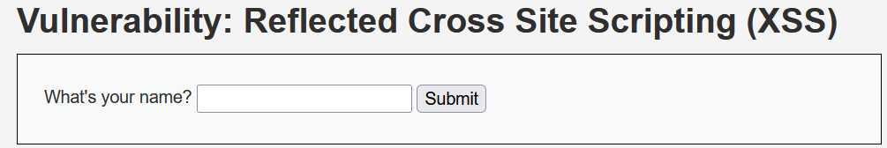
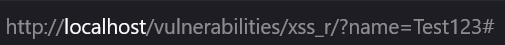
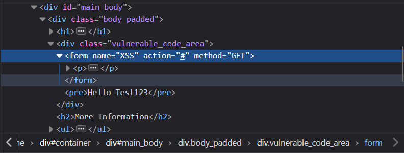
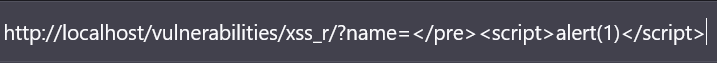
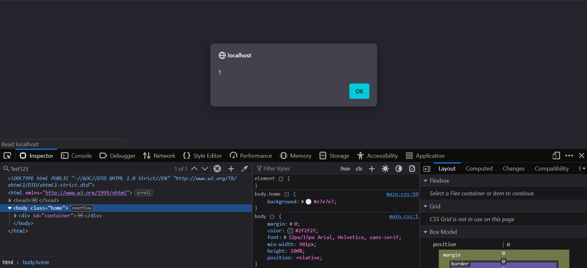

# Docker setup and demonstration on testing for reflected XSS
# INTRO

I built this Damn Vulnerable Web Application (DVWA) instance inside Docker as a personal, disposable lab for learning web-app security and practising bug-bounty techniques. Running DVWA in containers keeps the whole environment isolated and easily torn down, so I can explore SQLi, XSS, CSRF and other flaws without risking real systems, exposing services to the internet, or accidentally crossing legal boundaries.

# SETTING UP

A couple of quick notes on **ethics and safety:** only test on systems you own or explicitly have permission to test. Treat any findings from real targets with responsible disclosure practices. The environment described here is for education and practice only.
## Docker

To begin testing, you’ll need Docker. It’s straightforward to install — head to the Docker website
(https://www.docker.com/), download the installer for your OS, run the installation wizard, and follow the prompts. The install only takes a couple of minutes and requires a system restart. After you restart, Docker should start automatically; you can skip creating an account if you like. Once Docker is running — GO TIME — you’re ready to run DVWA.

## Running DVWA

To run DVWA inside Docker, you only need a single command — no complicated setup, no extra steps.

First, make sure Docker is installed and running on your system. Then open your terminal and run:

```bash
docker run --rm -it -p 80:80 vulnerables/web-dvwa
```

This command pulls the **DVWA** image (if you don’t already have it), starts it in an isolated container, and maps it to port **80** on your machine.  
Once it’s running, open your browser and go to:

```
http://localhost
```

You should see the DVWA login page.  
Default credentials are:

```
Username: admin
Password: password
```

After logging in, click **“Create / Reset Database”** to initialize the app, and you’re ready to start testing.

When you’re done, simply stop the container by pressing **Ctrl + C** — thanks to the `--rm` flag, Docker will automatically clean up everything when it exits.

Quick, simple, and safe — perfect for learning and experimenting without leaving a trace.

## Just in case

If you run into problems at any step, check the DVWA website or the Docker website for troubleshooting and installation instructions. Only test in this isolated lab or on targets you own/have explicit permission to test.

DVWA: https://hub.docker.com/r/vulnerables/web-dvwa
Docker: https://www.docker.com/

# My Write-ups

## XSS - Cross Site Scripting

### Reflected XSS:
"Reflected cross-site scripting (or XSS) arises when an application receives data in an HTTP request and includes that data within the immediate response in an unsafe way."
https://portswigger.net/web-security/cross-site-scripting/reflected

As I open the Reflected XSS test page, I spot an input field:



I type **"Test123"** into that field with the browser’s developer tools open, submit the form, and inspect what changes — watching the DOM (Document Object Model), the HTTP request/URL, and the page source to see exactly how and where my input is reflected.

After I submit the text, I see my input reflected in the URL:



In the page source it appears exactly as typed — for example:



I see my input rendered inside an HTML **`<pre>`** (preformatted text) element in the page source,

```HTML
<pre>Hello Test123</pre>
```
My thought process is: 
if my input is being placed inside a `<pre>` tag, I can try to break out of it directly through the URL parameter. By closing the existing `<pre>` tag, I might be able to inject a new `<script>` tag and execute my own code. The payload would look something like this:

```HTML
</pre><script>alert(1)</script>
```

In the URL, I now type this payload in like this:



I hit Enter and voilà — the page reloads and my alert pops up, confirming that the payload was successful.



This confirms that the input field is vulnerable to **Reflected Cross-Site Scripting (XSS)**. The application takes user-supplied data and reflects it back into the page without proper sanitization or output encoding, allowing arbitrary JavaScript execution. In a real-world scenario, this could be exploited to steal session cookies, perform unauthorized actions, or inject malicious content into the page.

Additional DVWA writeups exploring other vulnerabilities will be published over time and can be
found under the **Lab** tag on CyberFriday.

