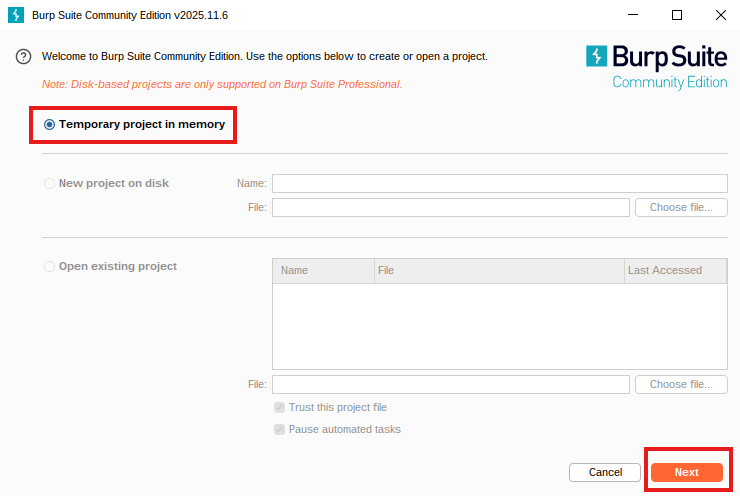
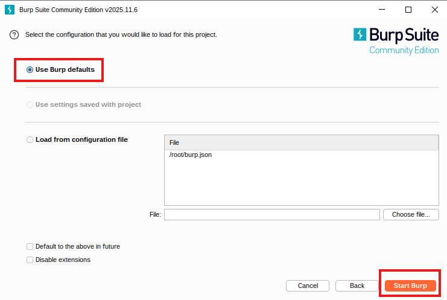
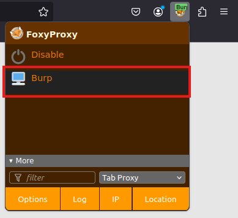
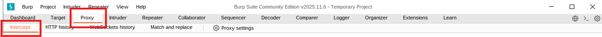
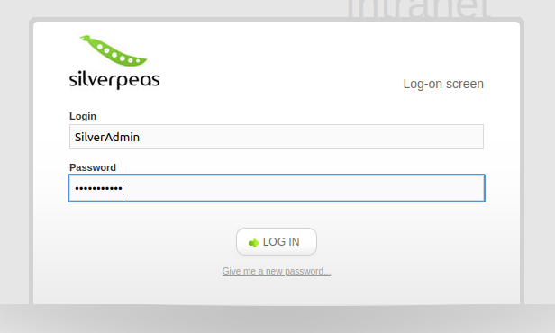
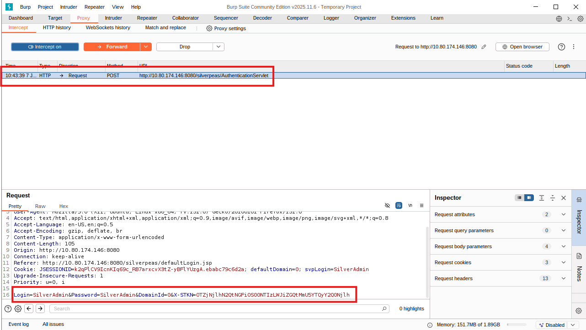
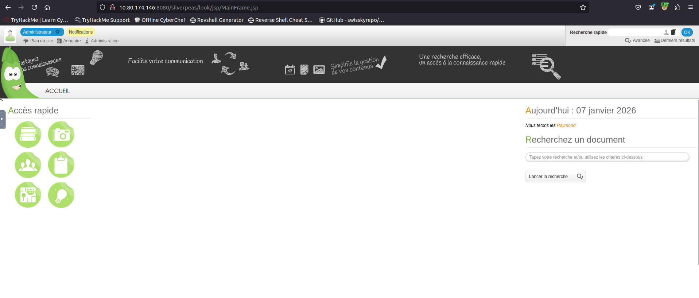

## Capturing and Modifying a Login Request with Burp Suite

This guide was written while solving the *Silver Platter* challenge on TryHackMe,  
but the process shown here is generally applicable to any web application that
handles authentication through HTTP requests.

Start by opening **Burp Suite** and keep the default options selected.  
  

While Burp Suite is loading, enable **FoxyProxy** in your browser so that all
traffic is routed through Burp.  

Once Burp Suite is open, navigate to the **Proxy** tab and ensure that
**Intercept** is set to **ON**.  

Next, open the target application’s login page (in this case, Silverpeas) and
enter valid credentials:

- **Username:** SilverAdmin  
- **Password:** SilverAdmin  

Then click **Log In**.  

After submitting the form, switch back to Burp Suite. The intercepted request
should now be visible. Scroll through the request body and locate the login
parameters, for example:

`Login=SilverAdmin&Password=SilverAdmin&DomainId=0`

To modify the request, remove the password parameter so that only the username
and domain remain. This kind of manipulation is commonly used when testing how
an application validates authentication data.  

Click **Forward**, then turn **Intercept** off.

If the application accepts the modified request, you should now gain access to
the authenticated area of the application.  

## Closing notes

Intercepting and modifying requests with Burp Suite is a foundational web
security technique and only scratches the surface of what the tool is capable
of. Beyond simple request inspection, Burp can be used for tasks such as
parameter tampering, authentication testing, input validation analysis, and
workflow mapping.

This guide focuses on the core mechanics of capturing and altering requests.
More advanced Burp Suite features and techniques will be covered in dedicated
posts as part of future writeups and guides on CyberFriday.

